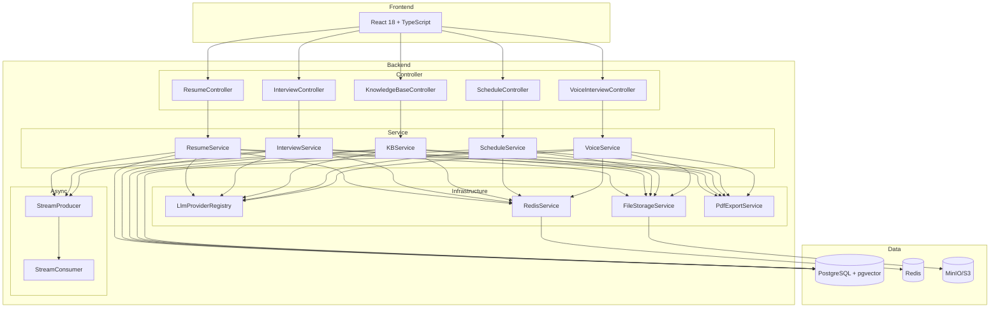

# 项目分析报告

## 一、项目概览

### 1.1 项目介绍

**语言**：Java 21 + TypeScript  
**框架**：Spring Boot 4.0 + React 18  
**范式**：fullstack（前后端一体）

AI Interview Platform 是一个基于 AI 的智能面试平台，支持简历上传解析、模拟面试、知识库 RAG 查询、面试日程管理、语音面试等核心功能。后端采用 Spring Boot 4.0 + Spring AI 2.0，前端采用 React 18 + Vite + TailwindCSS 4。

### 1.2 目录结构

```
interview-guide/
├── app/                              # 后端（Spring Boot）
│   ├── src/main/java/interview/guide/
│   │   ├── App.java                  # 主启动类
│   │   ├── common/                   # 通用基础能力
│   │   │   ├── ai/                   #   AI 服务（多 Provider 注册、结构化输出）
│   │   │   ├── annotation/           #   自定义注解（@RateLimit）
│   │   │   ├── aspect/               #   AOP 切面（限流）
│   │   │   ├── async/                #   异步模板（Redis Stream）
│   │   │   ├── config/               #   配置类（CORS、S3、Jackson、OpenAPI）
│   │   │   ├── constant/             #   常量定义
│   │   │   ├── evaluation/           #   统一评估服务
│   │   │   ├── exception/            #   异常体系（ErrorCode、BusinessException）
│   │   │   ├── model/                #   通用模型
│   │   │   └── result/               #   统一响应包装 Result<T>
│   │   ├── infrastructure/           # 技术基础设施
│   │   │   ├── export/               #   PDF 导出（iText 8）
│   │   │   ├── file/                 #   文件处理（Tika 解析、S3 存储、校验）
│   │   │   ├── mapper/               #   MapStruct 映射器
│   │   │   └── redis/                #   Redis 服务（缓存、Session）
│   │   └── modules/                  # 业务模块（自包含 MVC）
│   │       ├── resume/               #   简历管理（上传、解析、AI 评分）
│   │       ├── interview/            #   模拟面试（会话、AI 出题、评估）
│   │       ├── knowledgebase/        #   知识库（文档向量化、RAG 查询）
│   │       ├── interviewschedule/    #   面试日程（日历管理、AI 解析）
│   │       ├── voiceinterview/       #   语音面试（WebSocket、ASR/TTS）
│   │       └── llmprovider/          #   LLM Provider 管理（动态配置）
│   ├── src/main/resources/
│   │   ├── application.yml           # 主配置文件
│   │   ├── prompts/                  # AI Prompt 模板
│   │   └── skills/                   # Agent Skills 配置
│   ├── Dockerfile
│   └── build.gradle
│
├── frontend/                         # 前端（React）
│   ├── src/
│   │   ├── api/                      # API 请求封装
│   │   ├── components/               # 可复用组件
│   │   ├── pages/                    # 页面组件
│   │   ├── hooks/                    # 自定义 Hooks
│   │   ├── types/                    # TypeScript 类型定义
│   │   ├── utils/                    # 工具函数
│   │   └── App.tsx                   # 根组件
│   ├── vite.config.ts
│   ├── package.json
│   └── Dockerfile
│
├── docker-compose.yml                # 全栈编排（PostgreSQL + Redis + MinIO + App + Frontend）
├── docker-compose.dev.yml            # 开发环境编排
└── .env.example                      # 环境变量模板
```

### 1.3 依赖管理

**后端核心依赖**：

| 依赖 | 版本 | 用途 |
|------|------|------|
| Spring Boot | 4.0 | Web 框架 |
| Spring AI | 2.0 | AI 服务集成（OpenAI 兼容模式） |
| PostgreSQL Driver | - | 数据库驱动 |
| Redisson | 4.0 | Redis 客户端 |
| Apache Tika | - | 文档解析（PDF/DOCX/TXT） |
| AWS S3 SDK | - | 对象存储（兼容 MinIO/RustFS） |
| MapStruct | - | 对象映射 |
| iText 8 | - | PDF 导出 |
| DashScope SDK | 2.22.7 | 阿里云 ASR/TTS |
| Lombok | - | 代码简化 |
| SpringDoc | - | OpenAPI 文档 |

**前端核心依赖**：

| 依赖 | 版本 | 用途 |
|------|------|------|
| React | 18.3 | UI 框架 |
| React Router DOM | 7.11 | 路由管理 |
| Axios | 1.7 | HTTP 客户端 |
| TailwindCSS | 4.1 | 原子化 CSS |
| Framer Motion | 12.23 | 动画库 |
| Recharts | 3.6 | 图表库 |
| React Markdown | 9.0 | Markdown 渲染 |
| Vite | 5.4 | 构建工具 |
| TypeScript | 5.6 | 类型系统 |

### 1.4 技术栈

**后端**：
- Java 21（虚拟线程）
- Spring Boot 4.0 + Spring AI 2.0
- Spring Data JPA + PostgreSQL + pgvector（1024 维 COSINE 向量搜索）
- Redisson + Redis Stream（异步任务）
- MapStruct（对象映射）
- Apache Tika（文档解析）
- iText 8（PDF 导出）
- 阿里云 DashScope（Qwen3 ASR/TTS）

**前端**：
- React 18 + TypeScript
- Vite 5 + TailwindCSS 4
- React Router DOM 7
- Axios + Framer Motion + Recharts

**基础设施**：
- Docker Compose（全栈编排）
- PostgreSQL 16 + pgvector
- Redis 7
- MinIO（S3 兼容对象存储）

### 1.5 配置和部署

- **本地开发**：`docker-compose.dev.yml` 仅启动依赖服务（PostgreSQL + Redis + MinIO），后端通过 `bootRun` 启动
- **生产部署**：`docker-compose.yml` 全栈编排，包含前端 Nginx 反向代理
- **环境变量**：通过 `.env` 文件管理敏感信息（API Key、数据库密码等）
- **CI/CD**：未检测到 CI/CD 配置文件

---

## 二、Spring Boot 专项分析

### 2.1 架构模式

项目采用**模块化分层架构**：

```
Controller → Service → Repository
                ↕
          Infrastructure（Redis、FileStorage、PdfExport）
                ↕
          Common（AI、Async、Exception、Config）
```

**核心设计特征**：
- 每个业务模块（resume、interview、knowledgebase 等）自包含 MVC 三层
- 通用能力下沉至 `common/` 包（AI 服务、异步模板、异常体系、限流）
- 技术基础设施独立为 `infrastructure/` 包（文件处理、PDF 导出、Redis、MapStruct）
- 通过 `LlmProviderRegistry` 实现多 LLM Provider 动态路由
- 异步任务采用 Redis Stream + 生产者/消费者模式

### 2.2 架构图



### 2.3 核心流程

#### 简历上传与 AI 评分流程
1. 前端上传简历文件（PDF/DOCX/TXT）
2. `ResumeUploadService` 校验文件类型/大小 → `FileStorageService` 上传至 MinIO
3. `DocumentParseService` 使用 Tika 解析文档内容
4. `AnalyzeStreamProducer` 发送异步消息至 Redis Stream
5. `AnalyzeStreamConsumer` 消费消息 → 调用 LLM 进行简历分析评分
6. 结果持久化至 PostgreSQL

#### 模拟面试流程
1. 用户创建面试会话 → `InterviewSessionService` 创建 Session
2. `InterviewQuestionService` 调用 LLM 生成面试题
3. 用户提交答案 → `AnswerEvaluationService` 评估
4. `EvaluateStreamProducer/Consumer` 异步完成深度评估
5. `PdfExportService` 导出面试报告

#### 知识库 RAG 查询流程
1. 上传文档 → 向量化任务入队（Redis Stream）
2. `VectorizeStreamConsumer` 调用 Embedding 模型 → 存储至 pgvector
3. 查询时进行 Query Rewrite → 向量检索 → 构建 Prompt → LLM 生成回答

### 2.4 项目评估

| 维度 | 评估 |
|------|------|
| **分层合理性** | 良好，模块自包含 MVC，通用能力下沉 |
| **事务边界** | 需检查 Service 层 `@Transactional` 使用情况 |
| **异步设计** | Redis Stream 模板设计合理，支持失败重试 |
| **异常处理** | 统一 `BusinessException` + `ErrorCode` 分域设计 |
| **API 规范** | RESTful 风格，`@RateLimit` 限流保护 |
| **多 Provider** | `LlmProviderRegistry` 支持动态切换 LLM |
| **配置管理** | 集中 `@ConfigurationProperties`，敏感信息 `.env` |

---

## 三、React 前端专项分析

### 3.1 组件架构

```
App.tsx
├── Layout.tsx                    # 布局容器
├── Pages/                        # 页面级组件
│   ├── UploadPage.tsx            # 简历上传
│   ├── InterviewPage.tsx         # 模拟面试
│   ├── KnowledgeBase*.tsx        # 知识库管理/查询/上传
│   ├── InterviewSchedulePage.tsx # 面试日程
│   └── VoiceInterview*.tsx       # 语音面试
└── Components/                   # 可复用组件
    ├── InterviewPanel.tsx        # 面试面板
    ├── RadarChart.tsx            # 雷达图
    └── ...
```

### 3.2 技术特征

- **路由**：React Router DOM 7，按功能模块组织页面
- **状态管理**：未检测到 Redux/Zustand，可能使用 React Context 或局部状态
- **API 请求**：Axios 封装，统一拦截器处理
- **样式**：TailwindCSS 4 原子化 CSS + Framer Motion 动画
- **构建优化**：Vite 代码分割（react-vendor、ui-vendor、syntax-highlighter）

---

## 四、模块清单

### 4.1 模块拆分

| 模块 | 职责 | 核心类 |
|------|------|--------|
| **resume** | 简历上传、解析、AI 评分、去重、历史查询 | `ResumeUploadService`、`ResumeParseService`、`ResumeGradingService` |
| **interview** | 模拟面试会话、AI 出题、答题评估、报告导出 | `InterviewSessionService`、`InterviewQuestionService`、`AnswerEvaluationService` |
| **knowledgebase** | 文档上传、向量化、RAG 查询、聊天会话 | `KnowledgeBaseQueryService`、`RagChatSessionService`、`VectorizeStreamConsumer` |
| **interviewschedule** | 面试日程管理、AI 解析面试邀请 | `InterviewScheduleService`、`InterviewParseService` |
| **voiceinterview** | WebSocket 实时通话、ASR/TTS、多轮评估 | `VoiceInterviewWebSocketHandler`、`VoiceEvaluateStreamConsumer` |
| **llmprovider** | LLM Provider 动态配置、API Key 加密管理 | `LlmProviderConfigService`、`ApiKeyEncryptionService` |

### 4.2 模块间依赖关系

```
resume ─────────────────┐
interview ──────────────┤
knowledgebase ──────────┼──→ common（AI、Async、Exception）
interviewschedule ──────┤                  ↕
voiceinterview ─────────┤           infrastructure
llmprovider ────────────┘
```

所有业务模块依赖 `common/` 和 `infrastructure/`，模块间无直接依赖（通过 Controller 路由调用）。

---

## 五、包级文件说明

### 5.1 Common 包
| 目录 | 分析文档 | 职责 |
|------|----------|------|
| `common/ai/` | [Z-ai.md](file:///Users/niujifei/Documents/njf-workspace/pub_learn_project/github_project/interview-guide/app/src/main/java/interview/guide/common/ai/Z-ai.md) | LLM Provider 注册中心、结构化输出重试 |
| `common/exception/` | [Z-exception.md](file:///Users/niujifei/Documents/njf-workspace/pub_learn_project/github_project/interview-guide/app/src/main/java/interview/guide/common/exception/Z-exception.md) | ErrorCode 分域、BusinessException、全局异常处理 |
| `common/async/` | [Z-async.md](file:///Users/niujifei/Documents/njf-workspace/pub_learn_project/github_project/interview-guide/app/src/main/java/interview/guide/common/async/Z-async.md) | Redis Stream 生产者/消费者模板 |
| `common/aspect/` | [Z-aspect.md](file:///Users/niujifei/Documents/njf-workspace/pub_learn_project/github_project/interview-guide/app/src/main/java/interview/guide/common/aspect/Z-aspect.md) | @RateLimit AOP 切面、滑动窗口限流 |

### 5.2 Infrastructure 包
| 目录 | 分析文档 | 职责 |
|------|----------|------|
| `infrastructure/file/` | [Z-file.md](file:///Users/niujifei/Documents/njf-workspace/pub_learn_project/github_project/interview-guide/app/src/main/java/interview/guide/infrastructure/file/Z-file.md) | Tika 文档解析、S3/MinIO 文件存储、校验清洗 |
| `infrastructure/export/` | [Z-export.md](file:///Users/niujifei/Documents/njf-workspace/pub_learn_project/github_project/interview-guide/app/src/main/java/interview/guide/infrastructure/export/Z-export.md) | iText 8 PDF 导出（简历分析、面试报告） |
| `infrastructure/redis/` | [Z-redis.md](file:///Users/niujifei/Documents/njf-workspace/pub_learn_project/github_project/interview-guide/app/src/main/java/interview/guide/infrastructure/redis/Z-redis.md) | Redis 服务封装、面试会话缓存 |
| `infrastructure/mapper/` | [Z-mapper.md](file:///Users/niujifei/Documents/njf-workspace/pub_learn_project/github_project/interview-guide/app/src/main/java/interview/guide/infrastructure/mapper/Z-mapper.md) | MapStruct 映射器（Entity ↔ DTO） |

### 5.3 业务模块
| 模块 | 分析文档 | 职责 |
|------|----------|------|
| `modules/resume/` | [Z-resume.md](file:///Users/niujifei/Documents/njf-workspace/pub_learn_project/github_project/interview-guide/app/src/main/java/interview/guide/modules/resume/Z-resume.md) | 简历上传、解析、AI 评分、去重 |
| `modules/interview/` | [Z-interview.md](file:///Users/niujifei/Documents/njf-workspace/pub_learn_project/github_project/interview-guide/app/src/main/java/interview/guide/modules/interview/Z-interview.md) | 模拟面试会话、Skill 驱动出题、答题评估 |
| `modules/knowledgebase/` | [Z-knowledgebase.md](file:///Users/niujifei/Documents/njf-workspace/pub_learn_project/github_project/interview-guide/app/src/main/java/interview/guide/modules/knowledgebase/Z-knowledgebase.md) | 文档向量化、RAG 查询、多轮聊天 |
| `modules/voiceinterview/` | [Z-voiceinterview.md](file:///Users/niujifei/Documents/njf-workspace/pub_learn_project/github_project/interview-guide/app/src/main/java/interview/guide/modules/voiceinterview/Z-voiceinterview.md) | WebSocket 实时音频、ASR/TTS、多轮评估 |
| `modules/interviewschedule/` | [Z-interviewschedule.md](file:///Users/niujifei/Documents/njf-workspace/pub_learn_project/github_project/interview-guide/app/src/main/java/interview/guide/modules/interviewschedule/Z-interviewschedule.md) | 面试日程管理、AI 解析邀请 |
| `modules/llmprovider/` | [Z-llmprovider.md](file:///Users/niujifei/Documents/njf-workspace/pub_learn_project/github_project/interview-guide/app/src/main/java/interview/guide/modules/llmprovider/Z-llmprovider.md) | LLM Provider 动态配置、API Key 加密 |

### 5.4 前端包
| 目录 | 分析文档 | 职责 |
|------|----------|------|
| `frontend/src/api/` | [Z-api.md](file:///Users/niujifei/Documents/njf-workspace/pub_learn_project/github_project/interview-guide/frontend/src/api/Z-api.md) | Axios 封装、统一请求/响应拦截 |
| `frontend/src/pages/` | [Z-pages.md](file:///Users/niujifei/Documents/njf-workspace/pub_learn_project/github_project/interview-guide/frontend/src/pages/Z-pages.md) | 页面级组件、路由包装器 |
| `frontend/src/components/` | [Z-components.md](file:///Users/niujifei/Documents/njf-workspace/pub_learn_project/github_project/interview-guide/frontend/src/components/Z-components.md) | 可复用组件（布局、业务、通用） |
