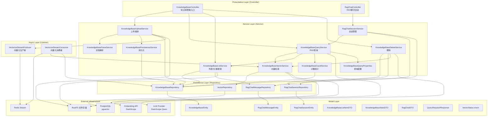
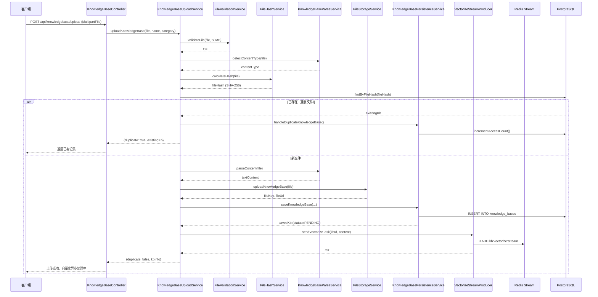
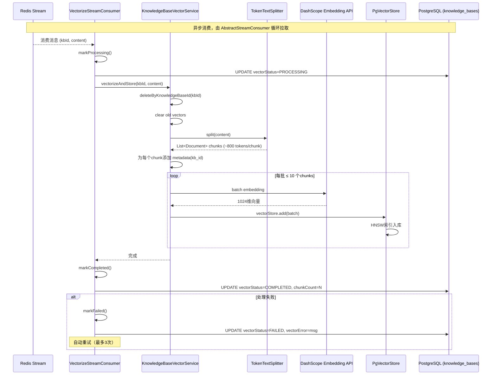
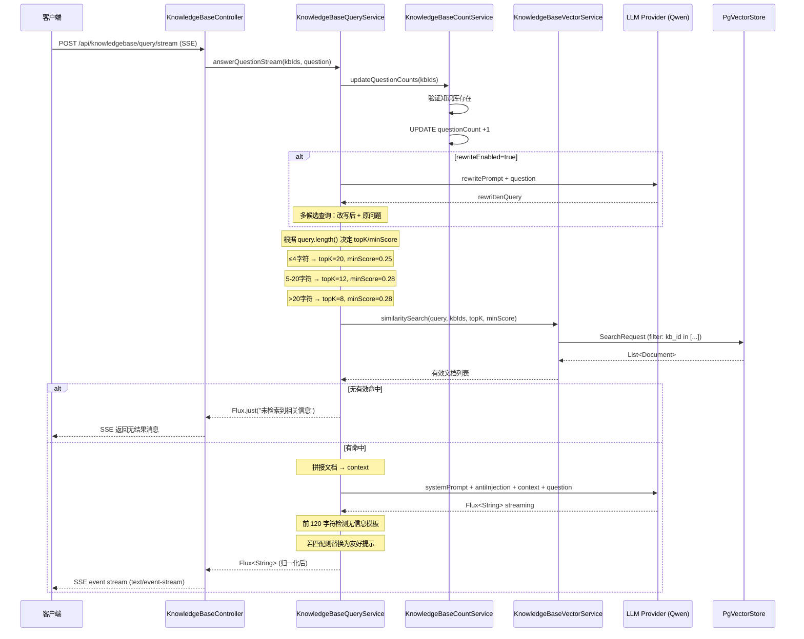
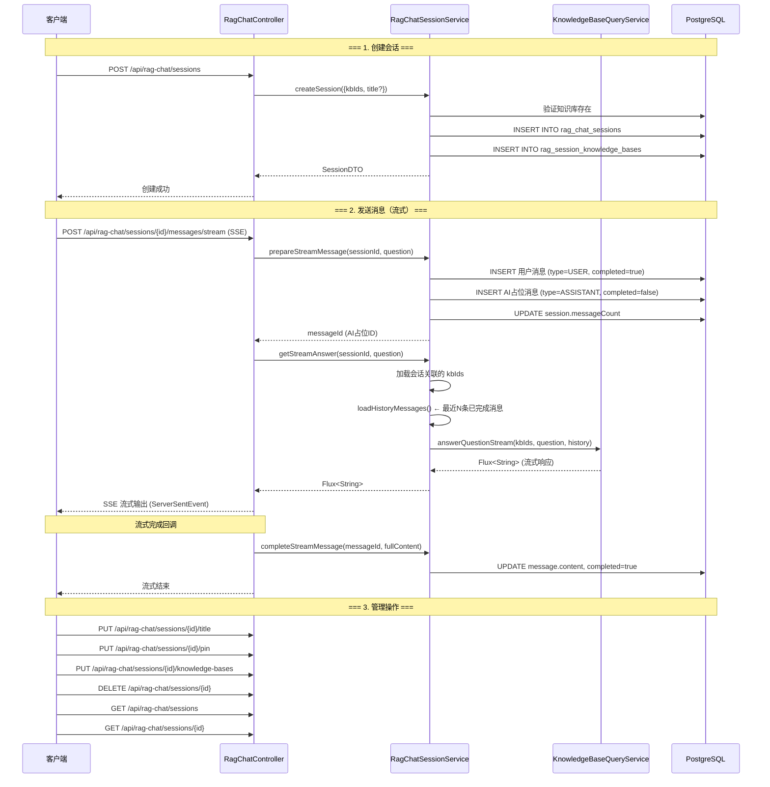
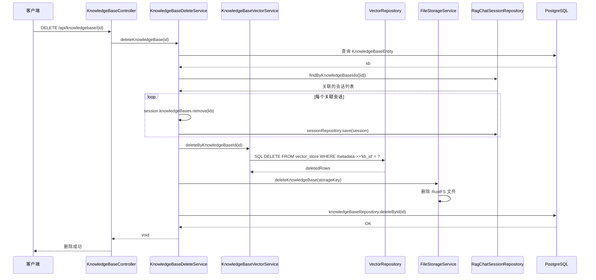
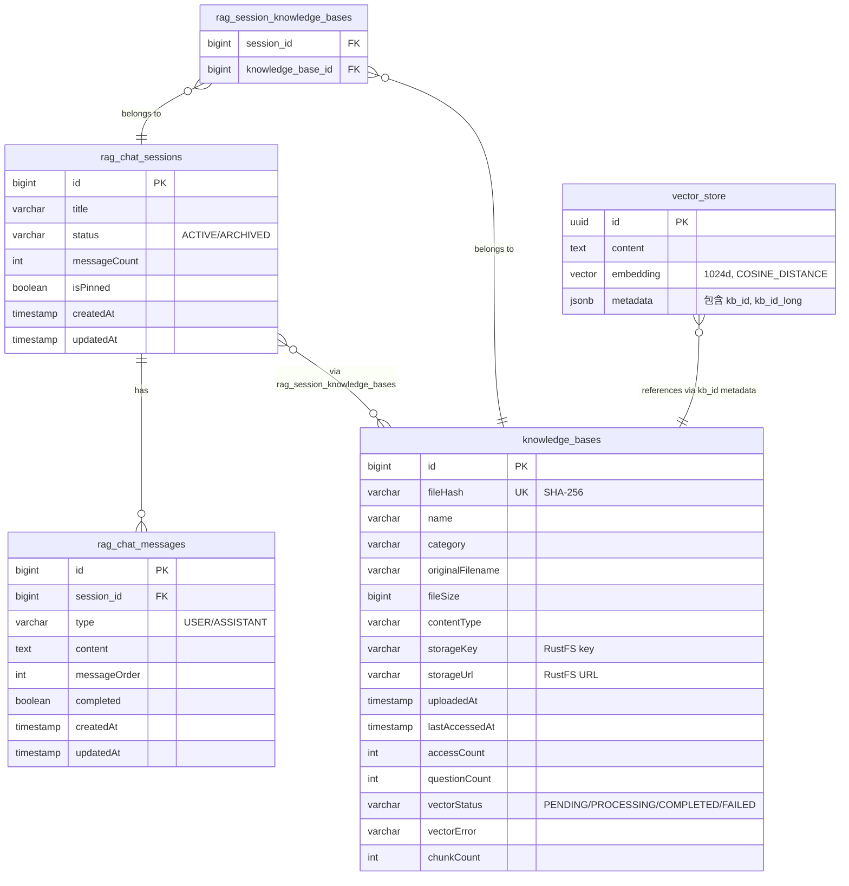

# knowledgebase 模块包分析

## 目录路径
`/Users/niujifei/Documents/njf-workspace/pub_learn_project/github_project/interview-guide/app/src/main/java/interview/guide/modules/knowledgebase/`

## 文件清单

### Controller 层
| 文件名 | 职责 | 关键注解/特征 |
|--------|------|---------------|
| `KnowledgeBaseController.java` | 知识库管理入口（上传、查询、列表、删除、向量化） | `@RestController`，`@RateLimit` |
| `RagChatController.java` | RAG 聊天会话管理 | `@RestController` |

### Service 层
| 文件名 | 职责 | 关键注解/特征 |
|--------|------|---------------|
| `KnowledgeBaseUploadService.java` | 知识库上传编排（校验→存储→入队向量化） | `@Service` |
| `KnowledgeBaseQueryService.java` | RAG 查询服务（向量检索 + LLM 回答） | `@Service`，支持 SSE 流式 |
| `KnowledgeBaseVectorService.java` | 向量服务（pgvector 相似度搜索） | `@Service` |
| `KnowledgeBaseListService.java` | 知识库列表/详情/搜索/分类 | `@Service` |
| `KnowledgeBaseDeleteService.java` | 知识库删除（含向量数据） | `@Service` |
| `KnowledgeBaseCountService.java` | 统计服务（问题计数等） | `@Service` |
| `KnowledgeBaseParseService.java` | 知识库文档解析 | `@Service` |
| `KnowledgeBasePersistenceService.java` | 知识库数据持久化 | `@Service` |
| `KnowledgeBaseQueryProperties.java` | RAG 查询配置（topK、minScore 等） | `@ConfigurationProperties` |
| `RagChatSessionService.java` | RAG 聊天会话管理 | `@Service` |

### Listener（异步）
| 文件名 | 职责 | 关键注解/特征 |
|--------|------|---------------|
| `VectorizeStreamProducer.java` | 向量化任务生产者 | 继承 `AbstractStreamProducer` |
| `VectorizeStreamConsumer.java` | 向量化任务消费者（Embedding + pgvector） | 继承 `AbstractStreamConsumer` |

### Model 层
| 文件名 | 职责 | 关键注解/特征 |
|--------|------|---------------|
| `KnowledgeBaseEntity.java` | 知识库实体 | `@Entity` |
| `RagChatSessionEntity.java` | RAG 聊天会话实体 | `@Entity` |
| `RagChatMessageEntity.java` | RAG 聊天消息实体 | `@Entity` |
| `QueryRequest/Response.java` | 查询请求/响应 | `record` |
| `VectorStatus.java` | 向量化状态枚举 | `enum` |

### Repository 层
| 文件名 | 职责 | 关键注解/特征 |
|--------|------|---------------|
| `KnowledgeBaseRepository.java` | 知识库数据访问 | `JpaRepository` |
| `RagChatSessionRepository.java` | RAG 会话数据访问 | `JpaRepository` |
| `RagChatMessageRepository.java` | RAG 消息数据访问 | `JpaRepository` |
| `VectorRepository.java` | 向量数据访问（Spring Data JPA + pgvector） | `@Query` 自定义向量查询 |

## 文件协作关系
- `KnowledgeBaseController` → `KnowledgeBaseUploadService`：上传文件
- `KnowledgeBaseController` → `KnowledgeBaseQueryService`：RAG 查询（同步/流式）
- `KnowledgeBaseController` → `KnowledgeBaseListService`：列表/搜索/分类
- `KnowledgeBaseUploadService` → `VectorizeStreamProducer`：入队向量化
- `VectorizeStreamConsumer` → `KnowledgeBaseVectorService` → Spring AI VectorStore：Embedding + pgvector
- `KnowledgeBaseQueryService` → `KnowledgeBaseVectorService.similaritySearch()`：向量检索
- `KnowledgeBaseQueryService` → `LlmProviderRegistry.getDefaultChatClient()`：LLM 回答
- `RagChatController` → `RagChatSessionService`：多轮聊天会话管理

## RAG 专项标注
- **Query Rewrite**：短查询改写（LLM 扩展语义），可配置开关
- **动态检索参数**：按查询长度动态调整 topK/minScore
  - 短查询（≤4 字符）：topK=20, minScore=0.18
  - 中等查询：topK=12, minScore=0.28
  - 长查询：topK=8, minScore=0.28
- **多候选查询**：改写后 + 原问题，逐个检索取有效结果
- **流式输出**：SSE 流式响应，探测窗口归一化（前 120 字符检测无信息模板）
- **向量存储**：Spring AI `PgVectorStore`，HNSW 索引，COSINE_DISTANCE，1024 维
- **反注入**：`PromptSecurityConstants.ANTI_INJECTION_INSTRUCTION` 附加到系统提示词

---

# 包架构分析

## 一、整体架构图

---

## 二、核心业务流程图

### 2.1 知识库上传流程

### 2.2 向量化异步处理流程

### 2.3 RAG 查询流程（流式）

### 2.4 RAG 聊天会话流程（多轮对话）

### 2.5 知识库删除流程

---

## 三、类关系图

### 3.1 分层类依赖关系

```mermaid
classDiagram
    %% ===== Controller =====
    class KnowledgeBaseController {
        +KnowledgeBaseUploadService uploadService
        +KnowledgeBaseQueryService queryService
        +KnowledgeBaseListService listService
        +KnowledgeBaseDeleteService deleteService
        +getAllKnowledgeBases() Result
        +getKnowledgeBase(id) Result
        +deleteKnowledgeBase(id) Result
        +queryKnowledgeBase(request) Result
        +queryKnowledgeBaseStream(request) Flux
        +uploadKnowledgeBase(file,name,category) Result
        +downloadKnowledgeBase(id) ResponseEntity
        +search(keyword) Result
        +getStatistics() Result
        +revectorize(id) Result
        +getAllCategories() Result
        +getByCategory(category) Result
        +updateCategory(id,body) Result
    }

    class RagChatController {
        +RagChatSessionService sessionService
        +createSession(request) Result
        +listSessions() Result
        +getSessionDetail(sessionId) Result
        +updateSessionTitle(sessionId,request) Result
        +togglePin(sessionId) Result
        +updateSessionKnowledgeBases(sessionId,request) Result
        +deleteSession(sessionId) Result
        +sendMessageStream(sessionId,request) Flux
    }

    %% ===== Service =====
    class KnowledgeBaseUploadService {
        +KnowledgeBaseParseService parseService
        +KnowledgeBasePersistenceService persistenceService
        +FileStorageService storageService
        +KnowledgeBaseRepository knowledgeBaseRepository
        +FileValidationService fileValidationService
        +FileHashService fileHashService
        +VectorizeStreamProducer vectorizeStreamProducer
        +uploadKnowledgeBase(file,name,category) Map
        +revectorize(kbId) void
    }

    class KnowledgeBaseQueryService {
        +LlmProviderRegistry llmProviderRegistry
        +KnowledgeBaseVectorService vectorService
        +KnowledgeBaseListService listService
        +KnowledgeBaseCountService countService
        +PromptTemplate systemPromptTemplate
        +PromptTemplate userPromptTemplate
        +PromptTemplate rewritePromptTemplate
        +answerQuestion(kbIds,question) String
        +answerQuestionStream(kbIds,question,history) Flux
        +queryKnowledgeBase(request) QueryResponse
    }

    class KnowledgeBaseVectorService {
        +VectorStore vectorStore
        +TextSplitter textSplitter
        +VectorRepository vectorRepository
        +vectorizeAndStore(kbId,content) void
        +similaritySearch(query,kbIds,topK,minScore) List~Document~
        +deleteByKnowledgeBaseId(kbId) void
    }

    class KnowledgeBaseListService {
        +KnowledgeBaseRepository knowledgeBaseRepository
        +RagChatMessageRepository ragChatMessageRepository
        +KnowledgeBaseMapper knowledgeBaseMapper
        +FileStorageService fileStorageService
        +listKnowledgeBases(status,sortBy) List~DTO~
        +getKnowledgeBase(id) Optional~DTO~
        +getKnowledgeBaseNames(ids) List~String~
        +search(keyword) List~DTO~
        +getStatistics() KnowledgeBaseStatsDTO
        +downloadFile(id) byte[]
        +getAllCategories() List~String~
        +listByCategory(category) List~DTO~
        +updateCategory(id,category) void
    }

    class KnowledgeBaseDeleteService {
        +KnowledgeBaseRepository knowledgeBaseRepository
        +RagChatSessionRepository sessionRepository
        +KnowledgeBaseVectorService vectorService
        +FileStorageService storageService
        +deleteKnowledgeBase(id) void
    }

    class KnowledgeBaseCountService {
        +KnowledgeBaseRepository knowledgeBaseRepository
        +updateQuestionCounts(kbIds) void
    }

    class KnowledgeBaseParseService {
        +DocumentParseService documentParseService
        +ContentTypeDetectionService contentTypeDetectionService
        +FileStorageService storageService
        +parseContent(file) String
        +parseContent(bytes,fileName) String
        +downloadAndParseContent(storageKey,filename) String
        +detectContentType(file) String
    }

    class KnowledgeBasePersistenceService {
        +KnowledgeBaseRepository knowledgeBaseRepository
        +handleDuplicateKnowledgeBase(kb,hash) Map
        +saveKnowledgeBase(file,name,category,key,url,hash) KnowledgeBaseEntity
        +updateVectorStatusToPending(kbId) void
    }

    class RagChatSessionService {
        +RagChatSessionRepository sessionRepository
        +RagChatMessageRepository messageRepository
        +KnowledgeBaseRepository knowledgeBaseRepository
        +KnowledgeBaseQueryService queryService
        +RagChatMapper ragChatMapper
        +KnowledgeBaseMapper knowledgeBaseMapper
        +KnowledgeBaseQueryProperties queryProperties
        +createSession(request) SessionDTO
        +listSessions() List~SessionListItemDTO~
        +getSessionDetail(sessionId) SessionDetailDTO
        +prepareStreamMessage(sessionId,question) Long
        +completeStreamMessage(messageId,content) void
        +getStreamAnswer(sessionId,question) Flux
        +updateSessionTitle(sessionId,title) void
        +togglePin(sessionId) void
        +deleteSession(sessionId) void
    }

    class KnowledgeBaseQueryProperties {
        +Rewrite rewrite
        +Search search
        +History history
        +String systemPromptPath
        +String userPromptPath
        +String rewritePromptPath
    }

    %% ===== Listener =====
    class VectorizeStreamProducer {
        +KnowledgeBaseRepository knowledgeBaseRepository
        +sendVectorizeTask(kbId,content) void
    }
    class VectorizeStreamConsumer {
        +KnowledgeBaseVectorService vectorService
        +KnowledgeBaseRepository knowledgeBaseRepository
    }

    %% ===== Repository =====
    class KnowledgeBaseRepository {
        <<interface>>
        +findByFileHash(hash) Optional~Entity~
        +findAllByOrderByUploadedAtDesc() List~Entity~
        +findAllCategories() List~String~
        +findByCategoryOrderByUploadedAtDesc(cat) List~Entity~
        +searchByKeyword(keyword) List~Entity~
        +incrementQuestionCountBatch(ids) int
        +countByVectorStatus(status) long
        +sumAccessCount() long
        +findByVectorStatusOrderByUploadedAtDesc(status) List~Entity~
    }

    class VectorRepository {
        +JdbcTemplate jdbcTemplate
        +deleteByKnowledgeBaseId(kbId) int
    }

    class RagChatSessionRepository {
        <<interface>>
        +findAllOrderByPinnedAndUpdatedAtDesc() List~Entity~
        +findByKnowledgeBaseIds(kbIds) List~Entity~
        +findByIdWithKnowledgeBases(id) Optional~Entity~
    }

    class RagChatMessageRepository {
        <<interface>>
        +findBySessionIdOrderByMessageOrderAsc(sessionId) List~Entity~
        +findRecentCompletedBySessionId(sessionId,pageable) List~Entity~
        +countByType(type) long
    }

    %% ===== Model =====
    class KnowledgeBaseEntity {
        +Long id
        +String fileHash
        +String name
        +String category
        +String originalFilename
        +Long fileSize
        +String contentType
        +String storageKey
        +String storageUrl
        +LocalDateTime uploadedAt
        +Integer accessCount
        +Integer questionCount
        +VectorStatus vectorStatus
        +String vectorError
        +Integer chunkCount
    }

    class RagChatSessionEntity {
        +Long id
        +String title
        +SessionStatus status
        +Set~KnowledgeBaseEntity~ knowledgeBases
        +List~RagChatMessageEntity~ messages
        +Integer messageCount
        +Boolean isPinned
        +getKnowledgeBaseIds() List~Long~
    }

    class RagChatMessageEntity {
        +Long id
        +RagChatSessionEntity session
        +MessageType type
        +String content
        +Integer messageOrder
        +Boolean completed
    }

    class VectorStatus {
        <<enum>>
        PENDING
        PROCESSING
        COMPLETED
        FAILED
    }

    class QueryRequest {
        <<record>>
        +List~Long~ knowledgeBaseIds
        +String question
    }

    class QueryResponse {
        <<record>>
        +String answer
        +Long knowledgeBaseId
        +String knowledgeBaseName
    }

    class KnowledgeBaseListItemDTO {
        <<record>>
        +Long id
        +String name
        +String category
        +VectorStatus vectorStatus
        +Integer chunkCount
    }

    class KnowledgeBaseStatsDTO {
        <<record>>
        +long totalCount
        +long totalQuestionCount
        +long totalAccessCount
        +long completedCount
        +long processingCount
    }

    class RagChatDTO {
        <<record>>
        +CreateSessionRequest
        +SendMessageRequest
        +SessionDTO
        +SessionListItemDTO
        +SessionDetailDTO
        +MessageDTO
    }

    %% ===== Relationships =====
    KnowledgeBaseController --> KnowledgeBaseUploadService
    KnowledgeBaseController --> KnowledgeBaseQueryService
    KnowledgeBaseController --> KnowledgeBaseListService
    KnowledgeBaseController --> KnowledgeBaseDeleteService

    RagChatController --> RagChatSessionService

    RagChatSessionService --> KnowledgeBaseQueryService
    RagChatSessionService --> KnowledgeBaseQueryProperties
    RagChatSessionService --> RagChatSessionRepository
    RagChatSessionService --> RagChatMessageRepository
    RagChatSessionService --> KnowledgeBaseRepository

    KnowledgeBaseUploadService --> KnowledgeBaseParseService
    KnowledgeBaseUploadService --> KnowledgeBasePersistenceService
    KnowledgeBaseUploadService --> KnowledgeBaseRepository
    KnowledgeBaseUploadService --> VectorizeStreamProducer

    KnowledgeBaseQueryService --> KnowledgeBaseVectorService
    KnowledgeBaseQueryService --> KnowledgeBaseListService
    KnowledgeBaseQueryService --> KnowledgeBaseCountService
    KnowledgeBaseQueryService --> KnowledgeBaseQueryProperties

    KnowledgeBaseVectorService --> VectorRepository

    KnowledgeBaseListService --> KnowledgeBaseRepository
    KnowledgeBaseListService --> RagChatMessageRepository

    KnowledgeBaseDeleteService --> KnowledgeBaseVectorService
    KnowledgeBaseDeleteService --> KnowledgeBaseRepository
    KnowledgeBaseDeleteService --> RagChatSessionRepository

    KnowledgeBaseCountService --> KnowledgeBaseRepository

    VectorizeStreamProducer --> KnowledgeBaseRepository
    VectorizeStreamConsumer --> KnowledgeBaseVectorService
    VectorizeStreamConsumer --> KnowledgeBaseRepository

    KnowledgeBaseRepository --> KnowledgeBaseEntity
    RagChatSessionRepository --> RagChatSessionEntity
    RagChatMessageRepository --> RagChatMessageEntity
    VectorRepository --> VectorStore
```

### 3.2 实体关系（ER 图）

---

## 四、核心设计模式与架构决策

| 维度 | 选型 | 说明 |
|------|------|------|
| **架构风格** | 分层架构（Controller → Service → Repository） | 清晰的职责分离，便于单元测试 |
| **异步处理** | 生产者-消费者模式（Redis Stream） | 文件上传后异步向量化，不阻塞上传响应 |
| **向量检索** | Spring AI PgVectorStore + HNSW 索引 | 基于 PostgreSQL 的 COSINE_DISTANCE 相似度搜索 |
| **流式响应** | SSE (Server-Sent Events) + Project Reactor | 实时流式输出 LLM 回答，支持多轮上下文 |
| **查询优化** | Query Rewrite + 动态检索参数 | 短查询用 LLM 扩展语义，按长度动态调整 topK/minScore |
| **去重机制** | SHA-256 文件哈希 | 相同内容文件只存储一次，仅更新访问计数 |
| **文件存储** | RustFS (分布式文件系统) | 文件内容与元数据分离，存储层解耦 |
| **配置管理** | @ConfigurationProperties + 嵌套静态类 | 按 Rewrite/Search/History 分组，类型安全 |
| **DTO 转换** | MapStruct (KnowledgeBaseMapper) | 编译期生成映射代码，避免运行时反射开销 |
| **数据一致性** | @Transactional 声明式事务 | 删除操作保证关联数据的事务一致性 |
| **限流保护** | @RateLimit 注解 | 全局和 IP 级别的请求限流，防止滥用 |